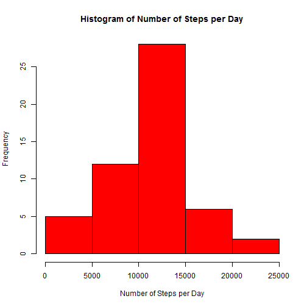
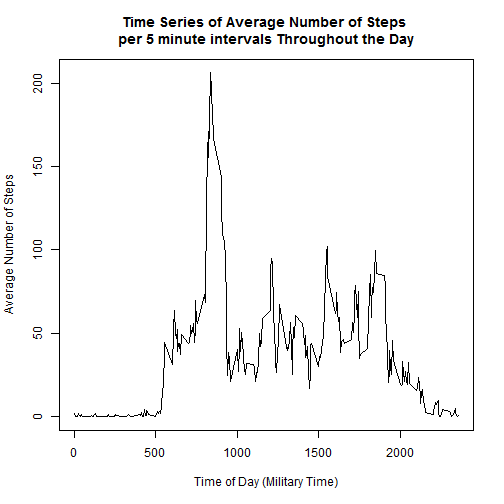
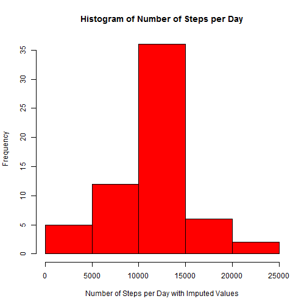

Peer Assessment 1
=================

This markdown file will walk the reader through analysis of the activity monitoring data.

#Reading in the data

First, the data must be read into R.  THe following code will read the data from the web, unzip it, load it into R, and format the variables.


```r
fileUrl <- "http://d396qusza40orc.cloudfront.net/repdata%2Fdata%2Factivity.zip"
download.file(fileUrl,destfile="actdata.zip")
unzip("actdata.zip", files="activity.csv")
act <- read.csv("./activity.csv")
act$date <- as.Date(act$date)
act$day <- weekdays(act$date)
```

#Histogram of Steps and Descriptive Stats

We will now find the number of steps per day and make this into a matrix. Then, a histogram of the number of steps per day and some basic summary statistics are shown.


```r
l<- lapply(split(act$steps,as.factor(act$date)),sum)
daily <- do.call(rbind,l)
hist(daily[,1],col="red", xlab="Number of Steps per Day", main="Histogram of Number of Steps per Day")
```

 

```r
mean(daily[,1], na.rm=TRUE)
```

```
## [1] 10766
```

```r
median(daily[,1], na.rm=TRUE)
```

```
## [1] 10765
```


#Daily Pattern of Steps

To examine the pattern of mean number of steps in a 5 minute interval across the day, we must create a new variable that is the mean of the intervals across days and plot them as a time series.  


```r
intm <- lapply(split(act$steps,as.factor(act$interval)),mean,na.rm=TRUE)
intmeans <- do.call(rbind,intm)
intmeans <- cbind(rownames(intmeans),intmeans)
plot(intmeans[,1],intmeans[,2],type='l',main="Time Series of Average Number of Steps \nper 5 minute intervals Throughout the Day",xlab="Time of Day (Military Time)",ylab="Average Number of Steps")
```

 


The following code will show the maximum average number of steps and what time of day on which it occurs.


```r
max(as.numeric(intmeans[,2]))
```

```
## [1] 206.2
```

```r
as.numeric(intmeans[which.max(as.numeric(intmeans[,2])),1])
```

```
## [1] 835
```

It is apparent from the data that the time of most activity is in the morning (around 8:30 AM) and there is continuing motion throughout the day with a clear down time during the evening and night (while sleeping).


#Missing Values

Because there are no missing values in the date or interval variable, the number of missing observations is simply the number of rows missing the *steps* variable.


```r
sum(is.na(act$steps))
```

```
## [1] 2304
```

For imputing missing values, I have chosen to replace the NAs with the mean number of steps from that particular interval of the day.  This choice was made to account for the variation throughout the day. 


```r
stepimp <- act$steps
act <- cbind(act,stepimp,meanint=as.numeric(rep(intmeans[,2],length(unique(act$date))))) #Recall intmeans created above
act$stepimp[is.na(act$stepimp)]<-act$meanint[is.na(act$stepimp)]
head(act)
```

```
##   steps       date interval    day stepimp meanint
## 1    NA 2012-10-01        0 Monday 1.71698 1.71698
## 2    NA 2012-10-01        5 Monday 0.33962 0.33962
## 3    NA 2012-10-01       10 Monday 0.13208 0.13208
## 4    NA 2012-10-01       15 Monday 0.15094 0.15094
## 5    NA 2012-10-01       20 Monday 0.07547 0.07547
## 6    NA 2012-10-01       25 Monday 2.09434 2.09434
```


Another histogram and summary data are computed for the number of steps per day with imputed data (mean per interval of time) replacing the NAs.


```r
l<- lapply(split(act$stepimp,as.factor(act$date)),sum)
daily <- do.call(rbind,l)
hist(daily[,1],col="red", xlab="Number of Steps per Day with Imputed Values", main="Histogram of Number of Steps per Day")
```

 

```r
mean(daily[,1], na.rm=TRUE)
```

```
## [1] 10766
```

```r
median(daily[,1], na.rm=TRUE)
```

```
## [1] 10766
```

This method of imputation has very little impact on the mean and median number of steps per day.  This is unsurprising as the replacement of the number of steps with the mean in that interval should be fairly consistent with the observed number of steps in a day.  Also, there are a large number of zeros in the dataset so a few extra steps on a given day would not have a huge impact on the average number of steps per day.

#Weekends vs. Weekdays

First, we need to create a new factor variable for weekdays.


```r
act$weekday<-"weekday"
act$weekday[act$day=="Saturday"] <- "weekend"
act$weekday[act$day=="Sunday"] <- "weekend"
act$weekday <- as.factor(act$weekday)
```

Within each of the categories (weekday and weekend), the average number of steps per interval of time were calculated and plotted. You'll notice a lot of type-casting/coercion.  I was having some trouble with the output of the split/lapply function which led to some odd types.  Any suggestions on improvement would be greatly appreciated. Note: I kept the calculations on the *imputed* data values replacing the NAs.  


```r
q <- split(act,act$weekday)
wd <- q[[1]]
we <- q[[2]]
```


```r
wd_int_m <- lapply(split(wd$steps,as.factor(wd$interval)),mean,na.rm=TRUE)
wd_int_means <- do.call(rbind,wd_int_m)
wd_int_means <- cbind(rownames(wd_int_means),wd_int_means,rep(1,length(wd_int_means)))


we_int_m <- lapply(split(we$steps,as.factor(we$interval)),mean,na.rm=TRUE)
we_int_means <- do.call(rbind,we_int_m)
we_int_means <- cbind(rownames(we_int_means),we_int_means,rep(2,length(we_int_means)))
```


```r
wd_we <- rbind(wd_int_means,we_int_means)

good <- cbind(as.numeric(as.character(wd_we[,1])), as.numeric(as.character(wd_we[,2])), as.factor(as.character(wd_we[,3])))
good_df <- as.data.frame(good)
names(good_df) <- c("interval","steps","day") 
good_df$day <- as.factor(good_df$day)
levels(good_df$day) <- c("weekday","weekend")

library(lattice)
xyplot(steps~interval | day, data=good_df,layout=c(1,2),type='l')
```

 


